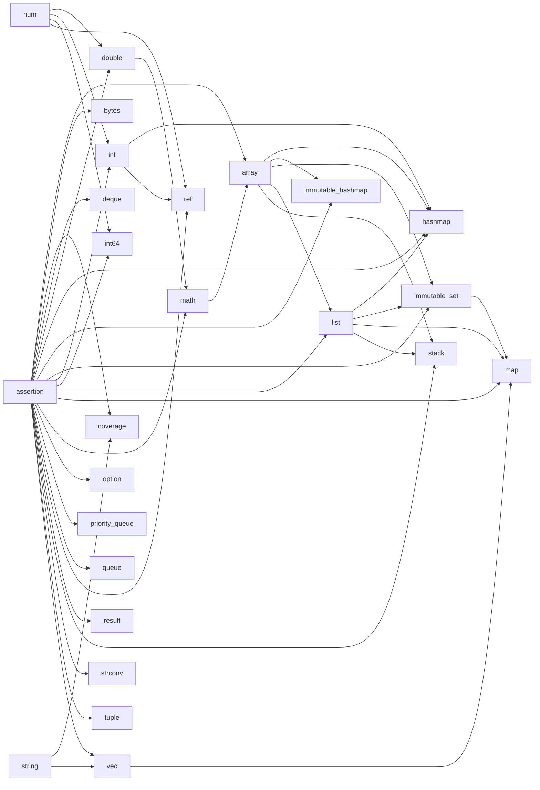

# Monnbit-Tree

Converting moonbit project dependency chains to mermaid code.

## Usage

```
npm install moonbit-tree -g
moonbit-tree > graph.mmd // In the project root directory
```

## Example(Monnbit/Core)


